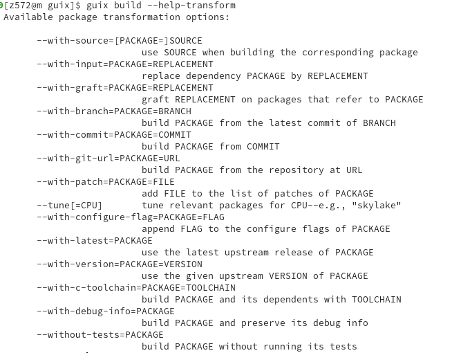
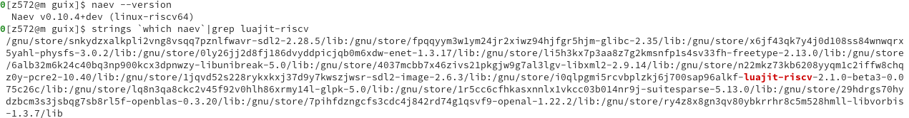
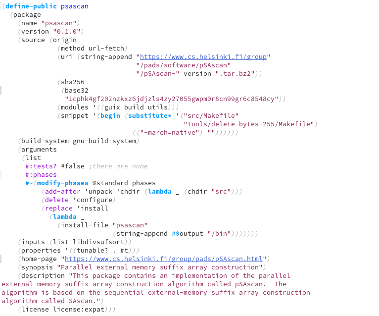
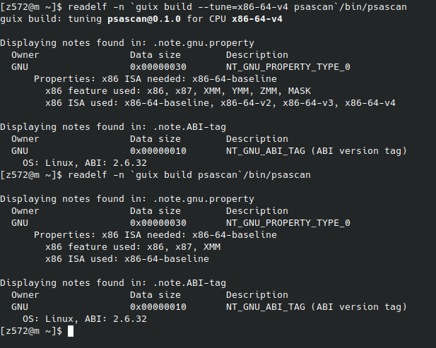
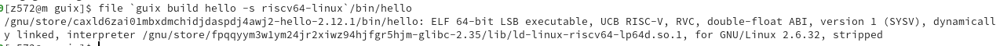
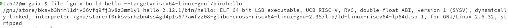
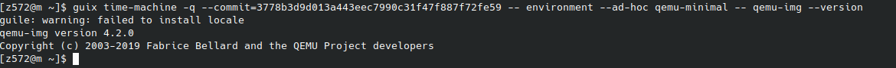
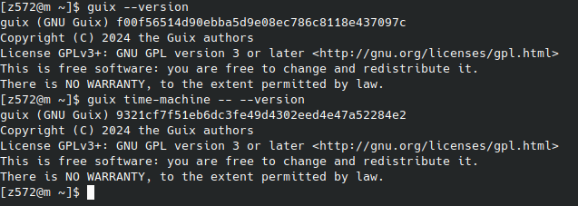
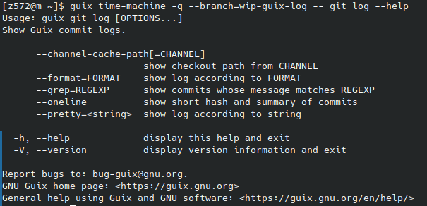

# &#30446;&#24405;

1.  [概念介绍](#org4d164e6)
2.  [优势](#org666140b)
    1.  [nix开创的函数式包管理](#orgc2fa25f)
    2.  [使用可复用的通用语言编写](#org5100370)
3.  [软件包变换](#org5e5836f)
    1.  [命令行修改软件包](#org4ae0735)
    2.  [编程方式修改软件包](#org730ab24)
    3.  [&#x2013;tune](#org6cc8eed)
    4.  [glibc-hwcaps（未内置于 guix）](#org87393c1)
    5.  [函数多版本化（未内置于 guix）](#orgbbf378a)
4.  [方便的编译及交叉编译软件](#org915a2a7)
    1.  [本地编译](#org88a2347)
        1.  [qemu 模拟编译](#org533165e)
        2.  [分派到 riscv 机器上](#org9eb2c3f)
    2.  [交叉编译](#orgd845515)
5.  [时光机](#org8c93b1f)
    1.  [过去](#orgcfc96aa)
    2.  [未来](#orga10f751)
    3.  [平行世界](#orga71a2c5)
6.  [还有更多&#x2026;](#orgd447d4a)
7.  [guix 当前状况](#orgaca4566)
8.  [下一步可能要做的事](#orgcef69e3)
9.  [还有一些资料](#orga57ae81)

# 概念介绍

guix<a id="fnr.1" class="footref" href="#fn.1" role="doc-backlink">1</a> 是一个纯功能性包管理器支持事务性升级和回滚、非特权软件包管
理、按用户配置文件和垃圾回收,提供了 Nix 首创的可重现性设计、命令行下的
Spack 软件包定制、轻松创建容器镜像等等

在 guix 里，软件包构建和安装过程被视为数学意义上的函数。函数获取输入，
如构建脚本、编译器和库，并且返回一个安装好的软件包。作为一个纯函数，它
的结果只取决于它的输入－－例如，它不能引用没有作为显式输入传入的软件和
脚本。当传入特定的输入时，一个构建函数总是得到相同的结果。它不能以任何
方式修改运行系统的环境，例如，它不能创建，修改，或删除构建和安装环境之
外的文件夹。这是通过在隔离的环境（容器）里运行构建进程实现的，在这个环
境里只能访问到显式的输入。

软件包构建函数的结果被缓存在文件系统里的一个叫做 store 的特殊文件夹内。
每个软件包都被安装在仓库（默认在/gnu/store）里的一个独立的文件夹内。这
个文件夹的名字含有用于构建这个软件包的所有输入的hash，所以，修改输入会
得到一个不同的文件夹名。

# 优势

## nix开创的函数式包管理

这带来了许多高级功能，可复现性，回滚等特性

## 使用可复用的通用语言编写

可以复用及促进生态, 并且允许动态生成包，以及修改包

# 软件包变换

假如 julia 和 octave 软件包依赖于通用的（未优化的） fftw 软件包，这样
我们就可以发布预编译的二进制文件。但如果希望 Octave 使用经过 AVX2 优化的
FFTW，该怎么办？

没关系，guix 支持软件包变换<a id="fnr.2" class="footref" href="#fn.2" role="doc-backlink">2</a>

## 命令行修改软件包

    $ guix install octave --with-input=fftw@3.3.5=fftw-avx

让我们安装的 octave 使用 fftw-avx 版本，就是对依赖图进行变换，把依
赖中的 fftw 3.3.5 版本进行替换，然后再对使用新依赖的软件包进行编译，这样我们能够享受到更强劲的性能且给我们带来了很大的灵活性。

还有更多选项:

## 编程方式修改软件包

当我们增加一款软件的 riscv 支持，需要使用真实软件进行测试， 我们可以像下面这样做

    (use-modules (gnu packages maths)
                 (guix packages)
                 (guix git-download)
                 (gnu packages lua)
                 (guix gexp)
                 (guix utils)
                 (gnu packages games))
    
    
    (define luajit/riscv
      (let ((branch "2.1.0-beta3")
            (commit "075c26ca398e88efe5a8246f4f4014e08a4addf9"))
        (package
          (inherit luajit)
          (name "luajit-riscv")
          (version (git-version branch "0" commit))
          (source (origin
                    (method git-fetch)
                    (uri (git-reference
                          (url "https://github.com/plctlab/LuaJIT")
                          (commit commit)))
                    (file-name (git-file-name name version))
                    (sha256
                     (base32
                      "0glid3xv4d9yx9v4zc8771wzldj9rvi5h05cyhm9kgk0ls97ra13"))))
          (arguments
           (substitute-keyword-arguments (package-arguments luajit)
             ((#:phases phases #~%standard-phases)
              #~(modify-phases #$phases
                  (delete 'create-luajit-symlink)))))
          (supported-systems (cons "riscv64-linux" (package-supported-systems luajit))))))
    (define replace-luajit-with-riscv-version
      ;; This is a procedure to replace luajit by luajit/riscv,
      ;; recursively.
      (package-input-rewriting `((,luajit . ,luajit/riscv))))
    
    (replace-luajit-with-riscv-version naev)

这样就以编程方式编译了使用 luajit riscv 版本的 naev

## &#x2013;tune

许多软件包可以受益于微架构，就可以在它的 properties 中标上
tunable?，这样在使用 \`guix build &#x2013;tune package\` 时
guix 内部会给 gcc/llvm 等设置相关 -march 参数,编译出来优化版本

## glibc-hwcaps<a id="fnr.3" class="footref" href="#fn.3" role="doc-backlink">3</a> （未内置于 guix）

这个功能在guix中还不存在，但是用户可以直接使用guix提供的库来使
glibc-hwcaps 工作

    ;; 我们导入相应库
      (use-modules (gnu packages maths)
                   (guix packages)
                   (guix gexp)
                   (guix utils))
    ;; 定义一个接受 psabi 的函数，它返回一个包
      (define (gsl-hwabi psabi)
        (package
          (inherit gsl)
          (name (string-append "gsl-" psabi))
          (arguments
           (substitute-keyword-arguments (package-arguments gsl)
             ((#:make-flags flags #~'())
              #~(append (list (string-append "CFLAGS=-march=" #$psabi)
                              (string-append "CXXFLAGS=-march=" #$psabi))
                        #$flags))
             ((#:configure-flags flags #~'())
              #~(append (list (string-append "--libdir=" #$output
                                             "/lib/glibc-hwcaps/" #$psabi))
                        #$flags))
             ;; The building machine can't necessarily run the code produced.
             ((#:tests? _ #t) #f)
             ((#:phases phases #~%standard-phases)
              #~(modify-phases #$phases
                  (add-after 'install 'remove-extra-files
                    (lambda _
                      (for-each (lambda (dir)
                                  (delete-file-recursively (string-append #$output dir)))
                                (list (string-append "/lib/glibc-hwcaps/" #$psabi "/pkgconfig")
                                      "/bin" "/include" "/share"))))))))
          (supported-systems '("x86_64-linux" "powerpc64le-linux"))
          (properties `((hidden? . #t)
                        (tunable? . #f)))))
    
      (define-public gsl-hwcaps
        (package
          (inherit gsl)
          (name "gsl-hwcaps")
          (arguments
           (substitute-keyword-arguments (package-arguments gsl)
             ((#:phases phases #~%standard-phases)
              #~(modify-phases #$phases
                  (add-after 'install 'install-optimized-libraries
                    (lambda* (#:key inputs outputs #:allow-other-keys)
                      (let ((hwcaps "/lib/glibc-hwcaps/"))
                        (for-each
                         (lambda (psabi)
                           (copy-recursively
                            (string-append (assoc-ref inputs (string-append "gsl-" psabi))
                                           hwcaps psabi)
                            (string-append #$output hwcaps psabi)))
                         '("x86-64-v2" "x86-64-v3" "x86-64-v4")))))))))
          (native-inputs
           (modify-inputs (package-native-inputs gsl)
             (append (gsl-hwabi "x86-64-v2")
                     (gsl-hwabi "x86-64-v3")
                     (gsl-hwabi "x86-64-v4"))))
          (supported-systems '("x86_64-linux"))
          (properties `((tunable? . #f)))))
      gsl-hwcaps

我们编写了这样一个文件，再使用 `guix install -f 这个文件` ，无需 guix 官方，
我们自己就能够享受到 glibc-hwcaps 的功能。

## 函数多版本化（未内置于 guix）

见 <https://gitlab.inria.fr/guix-hpc/function-multi-versioning> 
FMV 是一种技术，编译器根据不同的指令集架构（ISA）扩展生成代码；运行时，加载器会自动选择在主机 CPU 上性能最佳的实现。

只需要下面这几步

-   使用 GCC 的 -fopt-info-vec 选项构建软件包，并抓取所有矢量化机会的源代码位置
-   计算一个补丁，在相关函数上添加 `target_clones` 属性
-   使用该补丁重建软件包

生成的二进制文件就包含多个版本的函数:

    $ objdump -t $(GUIX_FMV_PACKAGE=gsl guix build -f function-multi-versioning.scm)/lib/libgsl.so | grep avx | head
    000000000009a480 l     F .text	00000000000003f5              bspline_pppack_bsplvd.avx2.0
    000000000009a880 l     F .text	0000000000000400              bspline_pppack_bsplvd.arch_skylake_avx512.1
    000000000009b080 l     F .text	0000000000000113              gsl_bspline_knots_uniform.avx2.0
    000000000009b1a0 l     F .text	00000000000000d8              gsl_bspline_knots_uniform.arch_skylake_avx512.1
    000000000009b3a0 l     F .text	000000000000012b              gsl_bspline_knots.avx2.0
    000000000009b4d0 l     F .text	000000000000012b              gsl_bspline_knots.arch_skylake_avx512.1
    000000000009be70 l     F .text	0000000000000125              gsl_bspline_eval.avx2.0
    000000000009bfa0 l     F .text	0000000000000125              gsl_bspline_eval.arch_skylake_avx512.1
    000000000009f120 l     F .text	0000000000000071              avl_t_copy.avx2.0
    000000000009f1a0 l     F .text	0000000000000071              avl_t_copy.arch_skylake_avx512.1

# 方便的编译及交叉编译软件

因为大部分包都使用 autotools/cmake/meson 等构建工具，并且具有相似的概
念，guix 抽象了包的定义以及编译系统等一系列相关概念，并在命令行界面提
供统一的体验。

而且因为统一在 /gnu/store ，所以多架构支持无需特别设置目录

想要一个在 riscv 上编译的 hello 只需要

    $ file `guix build hello -s riscv64-linux`/bin/hello
    /gnu/store/caxld6zai01mbxdmchidjdaspdj4awj2-hello-2.12.1/bin/hello: ELF 64-bit LSB executable, UCB RISC-V, RVC, double-float ABI, version 1 (SYSV), dynamically linked, interpreter /gnu/store/fpqqyym3w1ym24jr2xiwz94hjfgr5hjm-glibc-2.35/lib/ld-linux-riscv64-lp64d.so.1, for GNU/Linux 2.6.32, stripped

例如一个交叉编译到 riscv64 的 hello

    $ file `guix build hello --target=riscv64-linux-gnu`/bin/hello
    /gnu/store/bksvb3himl1div06vfq9fj3v8z3mm1yl-hello-2.12.1/bin/hello: ELF 64-bit LSB executable, UCB RISC-V, RVC, double-float ABI, version 1 (SYSV), dynamically linked, interpreter /gnu/store/f0rksvsrhzbn4ss4gd4p1s677awfzz08-glibc-cross-riscv64-linux-gnu-2.35/lib/ld-linux-riscv64-lp64d.so.1, for GNU/Linux 2.6.32, stripped

当前支持这些系统上的编译

    $ guix build --list-systems
    The available systems are:
    
       - x86_64-linux [current] 
       - aarch64-linux 
       - armhf-linux 
       - i586-gnu 
       - i686-linux 
       - mips64el-linux 
       - powerpc-linux 
       - powerpc64le-linux 
       - riscv64-linux

当前支持编译到这些目标

    $ guix build --list-targets
    The available targets are:
    
       - aarch64-linux-gnu 
       - arm-linux-gnueabihf 
       - avr 
       - i586-pc-gnu 
       - i686-linux-gnu 
       - i686-w64-mingw32 
       - mips64el-linux-gnu 
       - or1k-elf 
       - powerpc-linux-gnu 
       - powerpc64-linux-gnu 
       - powerpc64le-linux-gnu 
       - riscv64-linux-gnu 
       - x86_64-linux-gnu 
       - x86_64-linux-gnux32 
       - x86_64-w64-mingw32

这是如何做到的呢？

## 本地编译

### qemu 模拟编译

当我们设置了 binfmt 和 qemu(等 guix 支持了 binfmtmisc namespace就无需用户设置了)，guix 能够检测到支持，并且自动使用 qemu-user 进行编译。

### 分派到 riscv 机器上<a id="fnr.4" class="footref" href="#fn.4" role="doc-backlink">4</a>

当我们把装了 guix 的 riscv 机器设置加入本地 `/etc/guix/machines.scm`
并且相互信任，本地的 guix 就能够把这个任务通过 ssh 卸载到 riscv 机器上，让
riscv 机器上的 guix 进行编译，成功之后拉回来。

    (list (build-machine
         (name "fedora-riscv")
         (systems (list "riscv64-linux"))
         (host-key "ssh-ed25519 xxxxxxxxxxxxxxxxxxxxxxxxxxxxxxxxxxxxxxxxxxxxxxxxxxxxxxxxxxxxxxxxxxxx")
         (user "z572")
         (speed 2.)
         (parallel-builds 5)
         (private-key "/path/to/private-key")))

## 交叉编译

guix的 build-system 能够区分交叉编译和本地编译的不同，在交叉环境下会增
加额外需要的软件及修改相应步骤，只要软件比较正常，就能一键编译。

（当前的缺点是无法隔离 binfmtmisc，因此会泄漏到编译环境，让原本无法编
译通过的包可以通过，影响可复现性，幸好最近 linux 6.7 增加了
binfmtmisc namespace 的支持<a id="fnr.5" class="footref" href="#fn.5" role="doc-backlink">5</a>，未来可以改进这一点）

# 时光机

这是怎么做到的呢？因为每个 commit 的 guix 都拥有当前的软件依赖图，那么
只要当前的 guix 与目标的 guix 通信，让它去编译，就能还原环境。

## 过去

假如我编写了一本关于 riscv 的书，需要使用 qemu 进行实验，我可以选择常用
的 ubuntu linux，并根据当时的 qemu 的行为进行编写，但当几年过去 qemu
的行为改了，新版本的QEMU需要在SBI中初始化PMP才能运行，但书没法改，该怎
么办呢？

要么让读者找到旧版本的 qemu 要么提供虚拟机镜像，或者。。可以使用
guix!

      $ guix time-machine -q --commit=3778b3d9d013a443eec7990c31f47f887f72fe59 \
        -- environment --ad-hoc qemu-minimal \
        -- qemu-img --version
    guile: warning: failed to install locale
    qemu-img version 4.2.0
    Copyright (c) 2003-2019 Fabrice Bellard and the QEMU Project developers

因为 guix 捕获了所有依赖，并且明确知道这些包是可复现<a id="fnr.6" class="footref" href="#fn.6" role="doc-backlink">6</a>的，所以在
2024 年的今天，我们再次编译它出来的 qemu<a id="fnr.7" class="footref" href="#fn.7" role="doc-backlink">7</a> 就和几年前的 qemu 是同一个软
件，我们就能使用它就像几年前一样。

甚至如果我一开始就使用 guix 搭建环境并提供 guix 的相应提交<a id="fnr.8" class="footref" href="#fn.8" role="doc-backlink">8</a>及使用到的软
件包，别人就能轻松复现我的环境进行实验！

## 未来

当上游发生了大更新（例如 plasma 6 更新<a id="fnr.9" class="footref" href="#fn.9" role="doc-backlink">9</a>），但我不想更新系统，免得被新 bug 妨碍，但我真的需要新加入的某个软件/新功能，我就拿出时光机，临时到达未来

## 平行世界

当有人写了些有趣的功能，但没有合并到 guix 主线，例如 gsoc 有人编写了查看 log 的命令，

    guix time-machine -q --branch=wip-guix-log -- git log --oneline|less

我们来到了具有 \`guix git log\` 命令的平行世界！

# 还有更多&#x2026;

-   多设备/集群管理 (guix delpoy)<a id="fnr.10" class="footref" href="#fn.10" role="doc-backlink">10</a>
-   开发环境管理隔离 (guix shell<a id="fnr.11" class="footref" href="#fn.11" role="doc-backlink">11</a>/guix environment)
-   支持 hurd<a id="fnr.12" class="footref" href="#fn.12" role="doc-backlink">12</a>
-   事务性软件包升级和回滚(guix package)<a id="fnr.13" class="footref" href="#fn.13" role="doc-backlink">13</a>
-   系统管理(guix system)<a id="fnr.14" class="footref" href="#fn.14" role="doc-backlink">14</a>
-   家庭环境管理(guix home)<a id="fnr.15" class="footref" href="#fn.15" role="doc-backlink">15</a>
-   支持使用 tmpfs 的 / (我自己糊的，没链接)
-   无 root 权限安装使用软件及导入到 docker (guix pack)<a id="fnr.16" class="footref" href="#fn.16" role="doc-backlink">16</a>
-   现代版本的 lisp machine
-   Full-Source Bootstrap<a id="fnr.17" class="footref" href="#fn.17" role="doc-backlink">17</a>(现在只支持 x8664 和 arm64，riscv64 版本<a id="fnr.18" class="footref" href="#fn.18" role="doc-backlink">18</a>的在做)

# guix 当前状况

平均每个月 100 余人提交贡献，在 x8664 上拥有 29'000 多个包(如果加上
guix-science<a id="fnr.19" class="footref" href="#fn.19" role="doc-backlink">19</a> 提供的一系列 channel 就超过 52,000 多个包)，全部为
自由软件，但 riscv 支持不太行，虽然拥有 26'750 个软件 ，但系统只支持
HiFive Unmatched，编译机只有一台 HiFive Unmatched。而且许多特性还没有
支持 riscv

# 下一步可能要做的事

-   让 guix pack 依赖的 proot 支持riscv
-   修正 guile 在 riscv 上的 jit 支持
-   改进 guix 包的交叉编译状况
-   改进 guix 包在riscv下的编译状况
-   提高 guix 命令对交叉编译的支持情况
-   增加 guix system 对 riscv 开发板的适配
-   对 &#x2013;tune 选项增加riscv支持

# 还有一些资料

-   **<https://guix.gnu.org/>:** guix 官网
-   **<https://hpc.guix.info>:** guix-hpc 官网
-   **<https://github.com/guixcn/>:** guix 中文社区
-   **<https://mirror.sjtu.edu.cn/docs/guix>:** 国内镜像
-   **<https://libreplanet.org/wiki/Group:Guix>:** wiki
-   **<http://web.archive.org/web/20230927022235/https://jobs.inria.fr/public/classic/en/offres/2023-06635>:** 法国 NumPEx project 招聘人使用 guix 进行软件部署
-   **<https://carrv.github.io/2022/papers/CARRV2022_paper_1_Batten.pdf>:** The Case for Using Guix to EnableReproducible RISC-V Software & Hardware
-   **<https://www.nature.com/articles/s41597-022-01720-9.pdf>:** toward practical transparent verifiable and long-term reproducible research using Guix
-   **<https://www.gem5.org/project/2022/05/23/guix.html>:** 介绍了使用 guix 打包 gem5 的好处
-   **<https://bitcoinmagazine.com/technical/guix-makes-bitcoin-core-development-trustless>:** bitcoin-core 使用 guix 进行可复现验证
-   **<https://www.ncbi.nlm.nih.gov/pubmed/30277498>:** PiGx: reproducible genomics analysis pipelines with GNU Guix
-   <https://10years.guix.gnu.org/video/gnu-guix-and-the-risc-v-future/>

# &#33050;&#27880;

<a id="fn.1" href="#fnr.1">1</a> “Guix”读做“geeks”，或“ɡiːks”（国际音标）

<a id="fn.2" href="#fnr.2">2</a> <https://guix.gnu.org/manual/devel/en/html_node/Package-Transformation-Options.html>

<a id="fn.3" href="#fnr.3">3</a> <https://guix.gnu.org/en/blog/2024/building-packages-targeting-psabis/>

<a id="fn.4" href="#fnr.4">4</a> 见 <https://guix.gnu.org/en/manual/devel/en/html_node/Daemon-Offload-Setup.html>

<a id="fn.5" href="#fnr.5">5</a> <https://patchwork.kernel.org/project/linux-fsdevel/cover/20181010161430.11633-1-laurent@vivier.eu/>

<a id="fn.6" href="#fnr.6">6</a> 现在还是有很多包不太行，例如测试需要证书，当回溯到过去就会遇到
时光炸弹。需要停止时间同步加设置时间等操作,还有人修改了源文件，hash不
匹配了之类的问题

<a id="fn.7" href="#fnr.7">7</a> 但其实当时guix的qemu 没有开启 riscv 支持

<a id="fn.8" href="#fnr.8">8</a> 编写此文时我的提交 f00f56514d90ebba5d9e08ec786c8118e437097c

<a id="fn.9" href="#fnr.9">9</a> 我在更新，但现在还没有

<a id="fn.10" href="#fnr.10">10</a> <https://guix.gnu.org/manual/devel/en/html_node/Invoking-guix-deploy.html>

<a id="fn.11" href="#fnr.11">11</a> <https://guix.gnu.org/en/manual/devel/en/html_node/Invoking-guix-shell.html>

<a id="fn.12" href="#fnr.12">12</a> <https://guix.gnu.org/en/blog/2020/a-hello-world-virtual-machine-running-the-hurd/>

<a id="fn.13" href="#fnr.13">13</a> <https://guix.gnu.org/manual/devel/en/html_node/Invoking-guix-package.html>

<a id="fn.14" href="#fnr.14">14</a> <https://guix.gnu.org/manual/devel/en/html_node/System-Configuration.html>

<a id="fn.15" href="#fnr.15">15</a> <https://guix.gnu.org/manual/devel/en/html_node/Home-Configuration.html>

<a id="fn.16" href="#fnr.16">16</a> <https://guix.gnu.org/manual/en/html_node/Invoking-guix-pack.html>

<a id="fn.17" href="#fnr.17">17</a> <https://guix.gnu.org/manual/devel/en/html_node/Full_002dSource-Bootstrap.html>

<a id="fn.18" href="#fnr.18">18</a> <https://nlnet.nl/project/GNUMes-RISCV-bootstrap/>

<a id="fn.19" href="#fnr.19">19</a> <https://github.com/guix-science>
