# 硬件信息

qemu 8.0.2
smp 32
内存 30.2GB

OS 版本：openEuler-22.03-LTS-SP2 rc3
镜像地址：http://121.36.84.172/dailybuild/EBS-openEuler-22.03-LTS-SP2/rc3_openeuler-2023-06-04-00-51-42/virtual_machine_img/x86_64/openEuler-22.03-LTS-SP2-x86_64.qcow2.xz
软件源：http://121.36.84.172/dailybuild/EBS-openEuler-22.03-LTS-SP2/rc3_openeuler-2023-06-04-00-51-42/
ROS 软件源：http://119.3.219.20:82/openEuler:/ROS:/humble:/22.03:/LTS:/SP2/standard_x86_64/


```
sed -i 's|repo.openeuler.org./openEuler-22.03-LTS-SP2|121.36.84.172/dailybuild/EBS-openEuler-22.03-LTS-SP2/rc3_openeuler-2023-06-04-00-51-42|g' /etc/yum.repos.d/openEuler.repo
```


添加 ROS 源

新建 /etc/yum.repos.d/ROS.repo ，添加以下内容

```
[ros]
name=ros
baseurl=http://119.3.219.20:82/openEuler:/ROS:/humble:/22.03:/LTS:/SP2/standard_x86_64/
enabled=1
gpgcheck=0
```

# 安装与卸载
``` bash
dnf install -y ros-humble-ros-core
```

``` bash
dnf remove -y ros-humble-ros-core
```
执行 `source /opt/ros/humble/setup.sh`


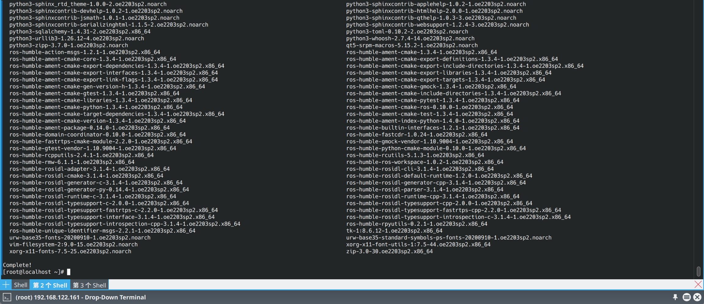

成功

# 测试 ros 基础工具相关功能
## ros2pkg
ros2 pkg prefix

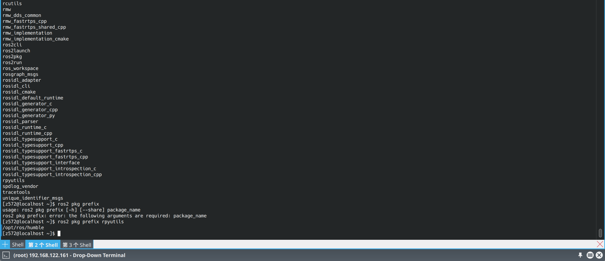

输入命令之后，终端存在打印，且程序正常输出 log，测试通过

## ros2topic

ros2 topic list

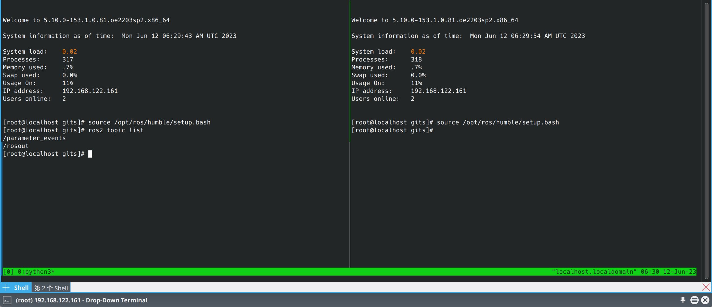

输入命令之后，终端存在打印，且程序正常输出 log，测试通过

## ros2param

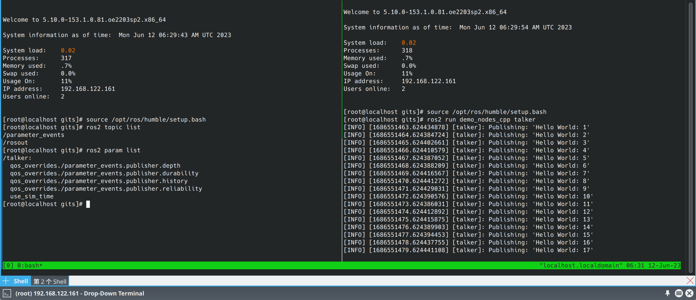

输入命令之后，终端存在打印，且程序正常输出 log，测试通过


## ros2service 

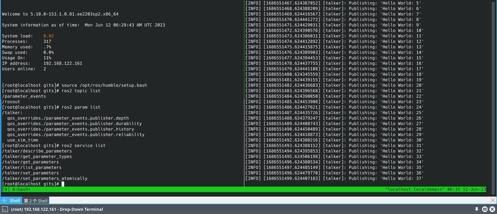

输入命令之后，终端存在打印，且程序正常输出 log，测试通过

## ros2node

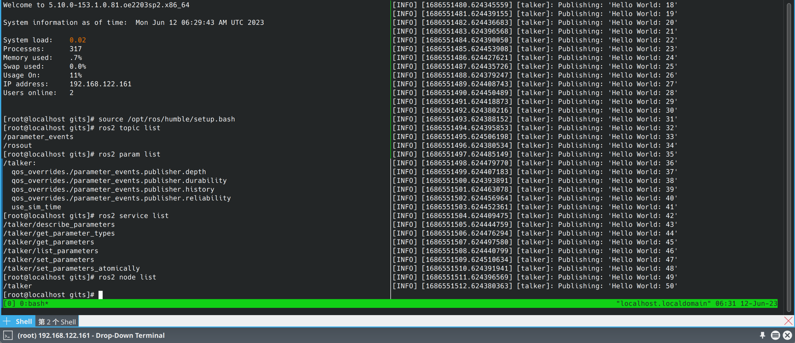

输入命令之后，终端存在打印，且程序正常输出 log，测试通过


## ros2bag

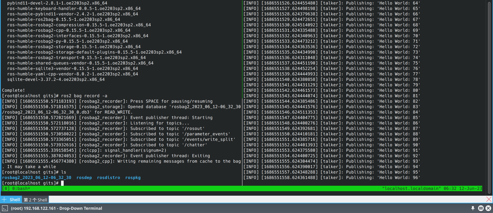

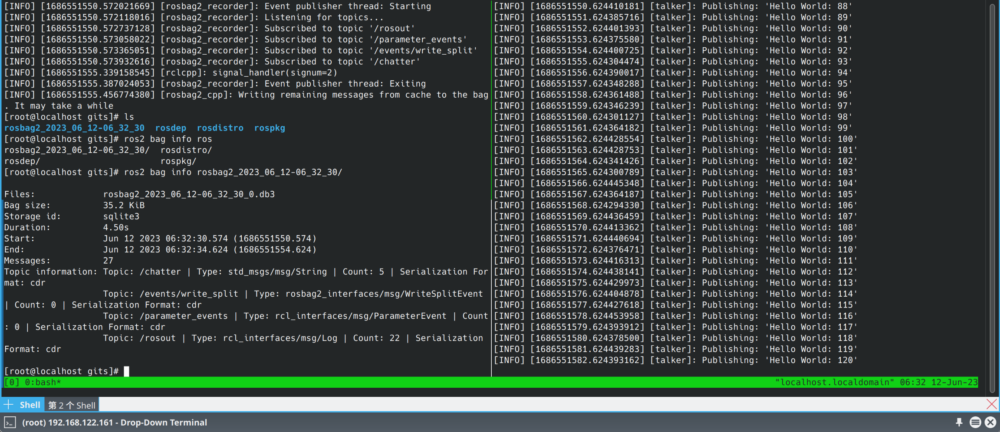

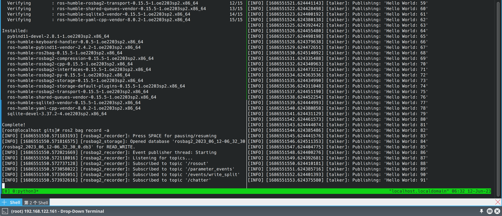

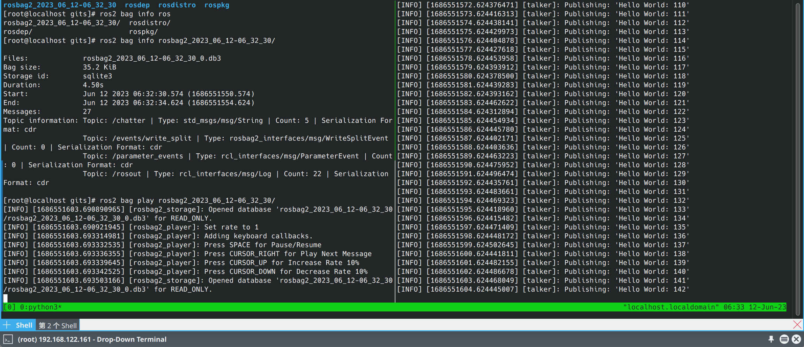

输入命令之后，终端存在打印，且程序正常输出 log，测试通过

## ros2launch 

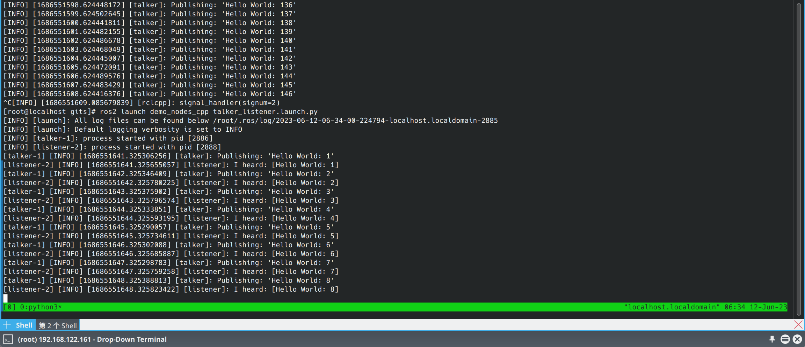

输入命令之后，终端存在打印，且程序正常输出 log，测试通过

### server 通信

#### python

在一个终端中输入

ros2 run demo_nodes_py add_two_ints_server


在另外一个终端中输入

ros2 run demo_nodes_py add_two_ints_client 

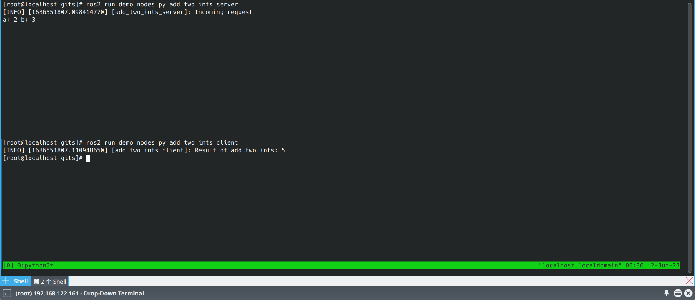

输入命令之后，终端存在打印，且程序正常输出 log，测试通过


#### cpp

在一个终端中输入

ros2 run demo_nodes_cpp add_two_ints_server


在另外一个终端中输入

ros2 run demo_nodes_cpp add_two_ints_client 

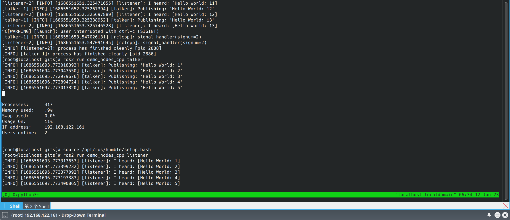

输入命令之后，终端存在打印，且程序正常输出 log，测试通过


## tf2

## 坐标转换的发布和订阅

### tf_monitor 监控

在一个终端中输入

ros2 run tf2_ros static_transform_publisher 1 1 1 0 0 0 /base_link /odom

在另一个终端中输入

ros2 run tf2_ros tf2_monitor

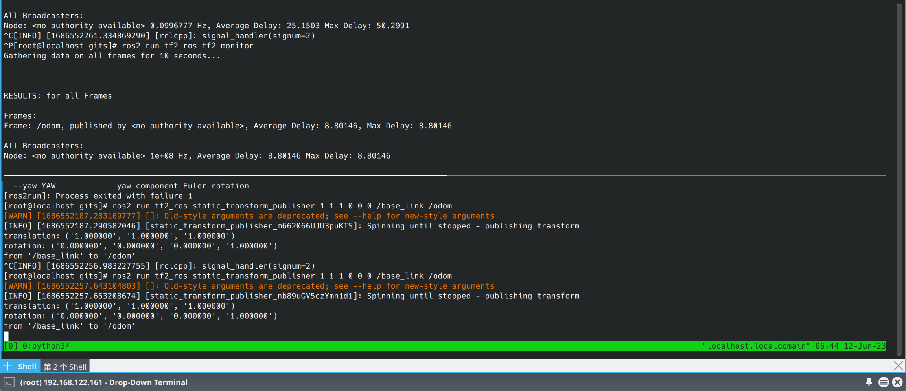
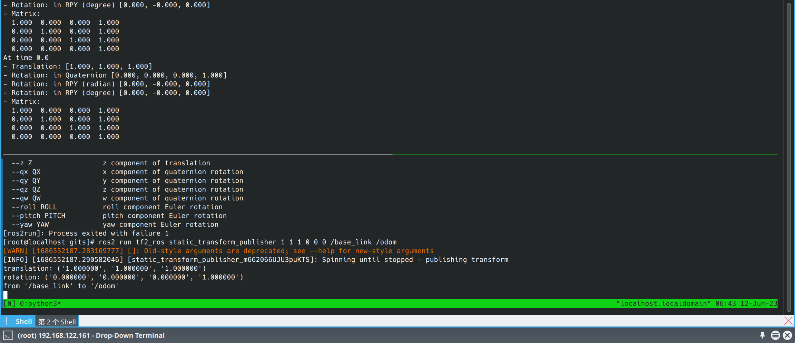

输入命令之后，终端存在打印，且程序正常输出 log，测试通过

### view_frames 保存 pdf


在一个终端中输入

```
ros2 run tf2_ros static_transform_publisher 1 1 1 0 0 0 /base_link /odom
```

在另一个终端中输入

```
ros2 run tf2_tools view_frames.py
```
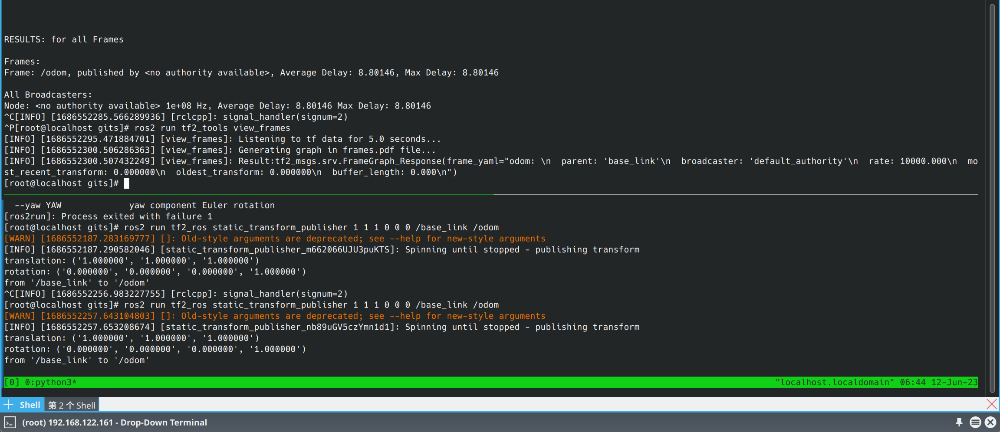

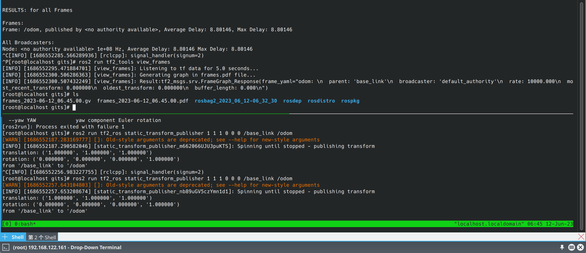
检查当前目录，存在 pdf 文件，测试通过

