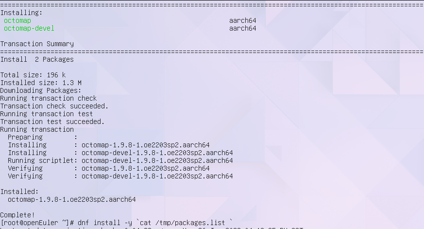

# 硬件信息

raspi 400


OS 版本：openEuler-22.03-LTS-SP2 rc5 

镜像地址： http://121.36.84.172/dailybuild/EBS-openEuler-22.03-LTS-SP2/rc5_openeuler-2023-06-26-01-36-02/raspi_img/openEuler-22.03-LTS-SP2-raspi-aarch64.img

- [软件源](./openEuler.repo) 
- [ROS 软件源](./ROS.repo)
- [软件包列表](./packages.list)

复制 openEuler.repo, ROS.repo 到 /etc/yum.repo.d/

# 安装与卸载

``` bash
dnf install -y `cat packages.list`
```

```
Last metadata expiration check: 0:01:17 ago on Mon 26 Jun 2023 04:12:25 PM CST.
Error: 
 Problem 1: package ros-humble-moveit-core-2.5.4-1.oe2203sp2.aarch64 requires fcl-devel, but none of the providers can be installed
  - conflicting requests
  - nothing provides pkgconfig(octomap) needed by fcl-devel-0.7.0-1.oe2203sp2.aarch64
 Problem 2: package ros-humble-chomp-motion-planner-2.5.4-1.oe2203sp2.aarch64 requires ros-humble-moveit-core, but none of the providers can be installed
  - package ros-humble-moveit-core-2.5.4-1.oe2203sp2.aarch64 requires fcl-devel, but none of the providers can be installed
  - conflicting requests
  - nothing provides pkgconfig(octomap) needed by fcl-devel-0.7.0-1.oe2203sp2.aarch64
 Problem 3: package ros-humble-moveit-2.5.4-1.oe2203sp2.aarch64 requires ros-humble-moveit-core, but none of the providers can be installed
  - package ros-humble-moveit-core-2.5.4-1.oe2203sp2.aarch64 requires fcl-devel, but none of the providers can be installed
  - conflicting requests
  - nothing provides pkgconfig(octomap) needed by fcl-devel-0.7.0-1.oe2203sp2.aarch64
 Problem 4: package ros-humble-moveit-chomp-optimizer-adapter-2.5.4-1.oe2203sp2.aarch64 requires ros-humble-moveit-core, but none of the providers can be installed
  - package ros-humble-moveit-core-2.5.4-1.oe2203sp2.aarch64 requires fcl-devel, but none of the providers can be installed
  - conflicting requests
  - nothing provides pkgconfig(octomap) needed by fcl-devel-0.7.0-1.oe2203sp2.aarch64
 Problem 5: package ros-humble-moveit-hybrid-planning-2.5.4-1.oe2203sp2.aarch64 requires ros-humble-moveit-core, but none of the providers can be installed
  - package ros-humble-moveit-core-2.5.4-1.oe2203sp2.aarch64 requires fcl-devel, but none of the providers can be installed
  - conflicting requests
  - nothing provides pkgconfig(octomap) needed by fcl-devel-0.7.0-1.oe2203sp2.aarch64
 Problem 6: package ros-humble-moveit-kinematics-2.5.4-1.oe2203sp2.aarch64 requires ros-humble-moveit-core, but none of the providers can be installed
  - package ros-humble-moveit-core-2.5.4-1.oe2203sp2.aarch64 requires fcl-devel, but none of the providers can be installed
  - conflicting requests
  - nothing provides pkgconfig(octomap) needed by fcl-devel-0.7.0-1.oe2203sp2.aarch64
 Problem 7: package ros-humble-moveit-planners-chomp-2.5.4-1.oe2203sp2.aarch64 requires ros-humble-moveit-core, but none of the providers can be installed
  - package ros-humble-moveit-core-2.5.4-1.oe2203sp2.aarch64 requires fcl-devel, but none of the providers can be installed
  - conflicting requests
  - nothing provides pkgconfig(octomap) needed by fcl-devel-0.7.0-1.oe2203sp2.aarch64
 Problem 8: package ros-humble-moveit-planners-ompl-2.5.4-1.oe2203sp2.aarch64 requires ros-humble-moveit-core, but none of the providers can be installed
  - package ros-humble-moveit-core-2.5.4-1.oe2203sp2.aarch64 requires fcl-devel, but none of the providers can be installed
  - conflicting requests
  - nothing provides pkgconfig(octomap) needed by fcl-devel-0.7.0-1.oe2203sp2.aarch64
 Problem 9: package ros-humble-moveit-resources-prbt-ikfast-manipulator-plugin-2.5.4-1.oe2203sp2.aarch64 requires ros-humble-moveit-core, but none of the providers can be installed
  - package ros-humble-moveit-core-2.5.4-1.oe2203sp2.aarch64 requires fcl-devel, but none of the providers can be installed
  - conflicting requests
  - nothing provides pkgconfig(octomap) needed by fcl-devel-0.7.0-1.oe2203sp2.aarch64
 Problem 10: package ros-humble-moveit-ros-control-interface-2.5.4-1.oe2203sp2.aarch64 requires ros-humble-moveit-core, but none of the providers can be installed
  - package ros-humble-moveit-core-2.5.4-1.oe2203sp2.aarch64 requires fcl-devel, but none of the providers can be installed
  - conflicting requests
  - nothing provides pkgconfig(octomap) needed by fcl-devel-0.7.0-1.oe2203sp2.aarch64
 Problem 11: package ros-humble-moveit-ros-move-group-2.5.4-1.oe2203sp2.aarch64 requires ros-humble-moveit-core, but none of the providers can be installed
  - package ros-humble-moveit-core-2.5.4-1.oe2203sp2.aarch64 requires fcl-devel, but none of the providers can be installed
  - conflicting requests
  - nothing provides pkgconfig(octomap) needed by fcl-devel-0.7.0-1.oe2203sp2.aarch64
 Problem 12: package ros-humble-moveit-ros-occupancy-map-monitor-2.5.4-1.oe2203sp2.aarch64 requires ros-humble-moveit-core, but none of the providers can be installed
  - package ros-humble-moveit-core-2.5.4-1.oe2203sp2.aarch64 requires fcl-devel, but none of the providers can be installed
  - conflicting requests
  - nothing provides pkgconfig(octomap) needed by fcl-devel-0.7.0-1.oe2203sp2.aarch64
 Problem 13: package ros-humble-moveit-ros-perception-2.5.4-1.oe2203sp2.aarch64 requires ros-humble-moveit-core, but none of the providers can be installed
  - package ros-humble-moveit-core-2.5.4-1.oe2203sp2.aarch64 requires fcl-devel, but none of the providers can be installed
  - conflicting requests
  - nothing provides pkgconfig(octomap) needed by fcl-devel-0.7.0-1.oe2203sp2.aarch64
 Problem 14: package ros-humble-moveit-ros-planning-2.5.4-1.oe2203sp2.aarch64 requires ros-humble-moveit-core, but none of the providers can be installed
  - package ros-humble-moveit-core-2.5.4-1.oe2203sp2.aarch64 requires fcl-devel, but none of the providers can be installed
  - conflicting requests
  - nothing provides pkgconfig(octomap) needed by fcl-devel-0.7.0-1.oe2203sp2.aarch64
 Problem 15: package ros-humble-moveit-ros-planning-interface-2.5.4-1.oe2203sp2.aarch64 requires ros-humble-moveit-core, but none of the providers can be installed
  - package ros-humble-moveit-core-2.5.4-1.oe2203sp2.aarch64 requires fcl-devel, but none of the providers can be installed
  - conflicting requests
  - nothing provides pkgconfig(octomap) needed by fcl-devel-0.7.0-1.oe2203sp2.aarch64
 Problem 16: package ros-humble-moveit-ros-robot-interaction-2.5.4-1.oe2203sp2.aarch64 requires ros-humble-moveit-core, but none of the providers can be installed
  - package ros-humble-moveit-core-2.5.4-1.oe2203sp2.aarch64 requires fcl-devel, but none of the providers can be installed
  - conflicting requests
  - nothing provides pkgconfig(octomap) needed by fcl-devel-0.7.0-1.oe2203sp2.aarch64
 Problem 17: package ros-humble-moveit-ros-warehouse-2.5.4-1.oe2203sp2.aarch64 requires ros-humble-moveit-core, but none of the providers can be installed
  - package ros-humble-moveit-core-2.5.4-1.oe2203sp2.aarch64 requires fcl-devel, but none of the providers can be installed
  - conflicting requests
  - nothing provides pkgconfig(octomap) needed by fcl-devel-0.7.0-1.oe2203sp2.aarch64
 Problem 18: package ros-humble-moveit-runtime-2.5.4-1.oe2203sp2.aarch64 requires ros-humble-moveit-core, but none of the providers can be installed
  - package ros-humble-moveit-core-2.5.4-1.oe2203sp2.aarch64 requires fcl-devel, but none of the providers can be installed
  - conflicting requests
  - nothing provides pkgconfig(octomap) needed by fcl-devel-0.7.0-1.oe2203sp2.aarch64
 Problem 19: package ros-humble-moveit-servo-2.5.4-1.oe2203sp2.aarch64 requires ros-humble-moveit-core, but none of the providers can be installed
  - package ros-humble-moveit-core-2.5.4-1.oe2203sp2.aarch64 requires fcl-devel, but none of the providers can be installed
  - conflicting requests
  - nothing provides pkgconfig(octomap) needed by fcl-devel-0.7.0-1.oe2203sp2.aarch64
 Problem 20: package ros-humble-moveit-setup-framework-2.5.4-1.oe2203sp2.aarch64 requires ros-humble-moveit-core, but none of the providers can be installed
  - package ros-humble-moveit-core-2.5.4-1.oe2203sp2.aarch64 requires fcl-devel, but none of the providers can be installed
  - conflicting requests
  - nothing provides pkgconfig(octomap) needed by fcl-devel-0.7.0-1.oe2203sp2.aarch64
 Problem 21: package ros-humble-moveit-simple-controller-manager-2.5.4-1.oe2203sp2.aarch64 requires ros-humble-moveit-core, but none of the providers can be installed
  - package ros-humble-moveit-core-2.5.4-1.oe2203sp2.aarch64 requires fcl-devel, but none of the providers can be installed
  - conflicting requests
  - nothing provides pkgconfig(octomap) needed by fcl-devel-0.7.0-1.oe2203sp2.aarch64
 Problem 22: package ros-humble-moveit-visual-tools-4.1.0-1.oe2203sp2.aarch64 requires ros-humble-moveit-core, but none of the providers can be installed
  - package ros-humble-moveit-core-2.5.4-1.oe2203sp2.aarch64 requires fcl-devel, but none of the providers can be installed
  - conflicting requests
  - nothing provides pkgconfig(octomap) needed by fcl-devel-0.7.0-1.oe2203sp2.aarch64
 Problem 23: package ros-humble-pick-ik-1.0.1-1.oe2203sp2.aarch64 requires ros-humble-moveit-core, but none of the providers can be installed
  - package ros-humble-moveit-core-2.5.4-1.oe2203sp2.aarch64 requires fcl-devel, but none of the providers can be installed
  - conflicting requests
  - nothing provides pkgconfig(octomap) needed by fcl-devel-0.7.0-1.oe2203sp2.aarch64
 Problem 24: package ros-humble-pilz-industrial-motion-planner-2.5.4-1.oe2203sp2.aarch64 requires ros-humble-moveit-core, but none of the providers can be installed
  - package ros-humble-moveit-core-2.5.4-1.oe2203sp2.aarch64 requires fcl-devel, but none of the providers can be installed
  - conflicting requests
  - nothing provides pkgconfig(octomap) needed by fcl-devel-0.7.0-1.oe2203sp2.aarch64
 Problem 25: package ros-humble-pilz-industrial-motion-planner-testutils-2.5.4-1.oe2203sp2.aarch64 requires ros-humble-moveit-core, but none of the providers can be installed
  - package ros-humble-moveit-core-2.5.4-1.oe2203sp2.aarch64 requires fcl-devel, but none of the providers can be installed
  - conflicting requests
  - nothing provides pkgconfig(octomap) needed by fcl-devel-0.7.0-1.oe2203sp2.aarch64
 Problem 26: package ros-humble-pilz-industrial-motion-planner-2.5.4-1.oe2203sp2.aarch64 requires ros-humble-moveit-core, but none of the providers can be installed
  - package ros-humble-moveit-planners-2.5.4-1.oe2203sp2.aarch64 requires ros-humble-pilz-industrial-motion-planner, but none of the providers can be installed
  - package ros-humble-moveit-core-2.5.4-1.oe2203sp2.aarch64 requires fcl-devel, but none of the providers can be installed
  - conflicting requests
  - nothing provides pkgconfig(octomap) needed by fcl-devel-0.7.0-1.oe2203sp2.aarch64
 Problem 27: package ros-humble-moveit-simple-controller-manager-2.5.4-1.oe2203sp2.aarch64 requires ros-humble-moveit-core, but none of the providers can be installed
  - package ros-humble-moveit-plugins-2.5.4-1.oe2203sp2.aarch64 requires ros-humble-moveit-simple-controller-manager, but none of the providers can be installed
  - package ros-humble-moveit-core-2.5.4-1.oe2203sp2.aarch64 requires fcl-devel, but none of the providers can be installed
  - conflicting requests
  - nothing provides pkgconfig(octomap) needed by fcl-devel-0.7.0-1.oe2203sp2.aarch64
 Problem 28: package ros-humble-moveit-setup-framework-2.5.4-1.oe2203sp2.aarch64 requires ros-humble-moveit-core, but none of the providers can be installed
  - package ros-humble-moveit-setup-app-plugins-2.5.4-1.oe2203sp2.aarch64 requires ros-humble-moveit-setup-framework, but none of the providers can be installed
  - package ros-humble-moveit-core-2.5.4-1.oe2203sp2.aarch64 requires fcl-devel, but none of the providers can be installed
  - conflicting requests
  - nothing provides pkgconfig(octomap) needed by fcl-devel-0.7.0-1.oe2203sp2.aarch64
 Problem 29: package ros-humble-moveit-setup-framework-2.5.4-1.oe2203sp2.aarch64 requires ros-humble-moveit-core, but none of the providers can be installed
  - package ros-humble-moveit-setup-assistant-2.5.4-1.oe2203sp2.aarch64 requires ros-humble-moveit-setup-framework, but none of the providers can be installed
  - package ros-humble-moveit-core-2.5.4-1.oe2203sp2.aarch64 requires fcl-devel, but none of the providers can be installed
  - conflicting requests
  - nothing provides pkgconfig(octomap) needed by fcl-devel-0.7.0-1.oe2203sp2.aarch64
 Problem 30: package ros-humble-moveit-setup-framework-2.5.4-1.oe2203sp2.aarch64 requires ros-humble-moveit-core, but none of the providers can be installed
  - package ros-humble-moveit-setup-controllers-2.5.4-1.oe2203sp2.aarch64 requires ros-humble-moveit-setup-framework, but none of the providers can be installed
  - package ros-humble-moveit-core-2.5.4-1.oe2203sp2.aarch64 requires fcl-devel, but none of the providers can be installed
  - conflicting requests
  - nothing provides pkgconfig(octomap) needed by fcl-devel-0.7.0-1.oe2203sp2.aarch64
 Problem 31: package ros-humble-moveit-setup-framework-2.5.4-1.oe2203sp2.aarch64 requires ros-humble-moveit-core, but none of the providers can be installed
  - package ros-humble-moveit-setup-core-plugins-2.5.4-1.oe2203sp2.aarch64 requires ros-humble-moveit-setup-framework, but none of the providers can be installed
  - package ros-humble-moveit-core-2.5.4-1.oe2203sp2.aarch64 requires fcl-devel, but none of the providers can be installed
  - conflicting requests
  - nothing provides pkgconfig(octomap) needed by fcl-devel-0.7.0-1.oe2203sp2.aarch64
 Problem 32: package ros-humble-moveit-setup-framework-2.5.4-1.oe2203sp2.aarch64 requires ros-humble-moveit-core, but none of the providers can be installed
  - package ros-humble-moveit-setup-srdf-plugins-2.5.4-1.oe2203sp2.aarch64 requires ros-humble-moveit-setup-framework, but none of the providers can be installed
  - package ros-humble-moveit-core-2.5.4-1.oe2203sp2.aarch64 requires fcl-devel, but none of the providers can be installed
  - conflicting requests
  - nothing provides pkgconfig(octomap) needed by fcl-devel-0.7.0-1.oe2203sp2.aarch64
 Problem 33: package ros-humble-moveit-ros-warehouse-2.5.4-1.oe2203sp2.aarch64 requires ros-humble-moveit-core, but none of the providers can be installed
  - package ros-humble-moveit-ros-2.5.4-1.oe2203sp2.aarch64 requires ros-humble-moveit-ros-warehouse, but none of the providers can be installed
  - package ros-humble-moveit-core-2.5.4-1.oe2203sp2.aarch64 requires fcl-devel, but none of the providers can be installed
  - conflicting requests
  - nothing provides pkgconfig(octomap) needed by fcl-devel-0.7.0-1.oe2203sp2.aarch64
 Problem 34: package ros-humble-moveit-ros-warehouse-2.5.4-1.oe2203sp2.aarch64 requires ros-humble-moveit-core, but none of the providers can be installed
  - package ros-humble-moveit-ros-benchmarks-2.5.4-1.oe2203sp2.aarch64 requires ros-humble-moveit-ros-warehouse, but none of the providers can be installed
  - package ros-humble-moveit-core-2.5.4-1.oe2203sp2.aarch64 requires fcl-devel, but none of the providers can be installed
  - conflicting requests
  - nothing provides pkgconfig(octomap) needed by fcl-devel-0.7.0-1.oe2203sp2.aarch64
 Problem 35: package ros-humble-moveit-ros-warehouse-2.5.4-1.oe2203sp2.aarch64 requires ros-humble-moveit-core, but none of the providers can be installed
  - package ros-humble-moveit-ros-visualization-2.5.4-1.oe2203sp2.aarch64 requires ros-humble-moveit-ros-warehouse, but none of the providers can be installed
  - package ros-humble-moveit-core-2.5.4-1.oe2203sp2.aarch64 requires fcl-devel, but none of the providers can be installed
  - conflicting requests
  - nothing provides pkgconfig(octomap) needed by fcl-devel-0.7.0-1.oe2203sp2.aarch64
 Problem 36: package ros-humble-moveit-ros-move-group-2.5.4-1.oe2203sp2.aarch64 requires ros-humble-moveit-core, but none of the providers can be installed
  - package ros-humble-moveit-resources-prbt-moveit-config-2.5.4-1.oe2203sp2.aarch64 requires ros-humble-moveit-ros-move-group, but none of the providers can be installed
  - package ros-humble-moveit-core-2.5.4-1.oe2203sp2.aarch64 requires fcl-devel, but none of the providers can be installed
  - conflicting requests
  - nothing provides pkgconfig(octomap) needed by fcl-devel-0.7.0-1.oe2203sp2.aarch64
 Problem 37: package ros-humble-moveit-ros-move-group-2.5.4-1.oe2203sp2.aarch64 requires ros-humble-moveit-core, but none of the providers can be installed
  - package ros-humble-tiago-moveit-config-3.0.1-1.oe2203sp2.aarch64 requires ros-humble-moveit-ros-move-group, but none of the providers can be installed
  - package ros-humble-moveit-core-2.5.4-1.oe2203sp2.aarch64 requires fcl-devel, but none of the providers can be installed
  - conflicting requests
  - nothing provides pkgconfig(octomap) needed by fcl-devel-0.7.0-1.oe2203sp2.aarch64
 Problem 38: package ros-humble-moveit-resources-prbt-ikfast-manipulator-plugin-2.5.4-1.oe2203sp2.aarch64 requires ros-humble-moveit-core, but none of the providers can be installed
  - package ros-humble-moveit-resources-prbt-pg70-support-2.5.4-1.oe2203sp2.aarch64 requires ros-humble-moveit-resources-prbt-ikfast-manipulator-plugin, but none of the providers can be installed
  - package ros-humble-moveit-core-2.5.4-1.oe2203sp2.aarch64 requires fcl-devel, but none of the providers can be installed
  - conflicting requests
  - nothing provides pkgconfig(octomap) needed by fcl-devel-0.7.0-1.oe2203sp2.aarch64
(try to add '--skip-broken' to skip uninstallable packages or '--nobest' to use not only best candidate packages)
```
包 octomap、octomap-devel 缺失

下载
http://119.3.219.20:82/openEuler:/ROS:/humble:/22.03:/LTS:/SP2/standard_aarch64/aarch64/octomap-1.9.8-1.oe2203sp2.aarch64.rpm 
http://119.3.219.20:82/openEuler:/ROS:/humble:/22.03:/LTS:/SP2/standard_aarch64/aarch64/octomap-devel-1.9.8-1.oe2203sp2.aarch64.rpm
并安装 解决




``` bash
dnf remove -y `cat packages.list`
```


成功

# colcon
尚未打包, 使用 pip

```
python3 -m venv colcon
source colcon/bin/activate
pip install colcon-common-extensions
mkdir -p work && cd work && colcon build && ls

```


输入命令之后，终端存在打印，且程序正常输出 log，测试通过

# 测试 ros 基础工具相关功能
测试前 `source /opt/ros/humble/setup.bash`

## ros2pkg
```
ros2 pkg prefix
```


输入命令之后，终端存在打印，且程序正常输出 log，测试通过

### executable


输入命令之后，终端存在打印，且程序正常输出 log，测试通过

### xml


输入命令之后，终端存在打印，且程序正常输出 log，测试通过

### list


输入命令之后，终端存在打印，且程序正常输出 log，测试通过

## ros2topic
```
ros2 topic list
```


输入命令之后，终端存在打印，且程序正常输出 log，测试通过


## ros2param

分别执行 `ros2 run demo_nodes_cpp talker`, `ros2 param list` 


输入命令之后，终端存在打印，且程序正常输出 log，测试通过

## ros2service 
分别执行命令 `ros2 run demo_nodes_cpp talker`, `ros2 service list`


输入命令之后，终端存在打印，且程序正常输出 log，测试通过

## ros2node

分别执行命令 `ros2 run demo_nodes_cpp talker`, `ros2 node list`


输入命令之后，终端存在打印，且程序正常输出 log，测试通过

## ros2bag

### record


输入命令之后，终端存在打印，且程序正常输出 log, 测试通过
### info


输入命令之后，终端存在打印，且程序正常输出 log, 测试通过

### play


输入命令之后，终端存在打印，且程序正常输出 log, 测试通过

## ros2launch 


输入命令之后，终端存在打印，且程序正常输出 log，测试通过

### server 通信

#### python

在一个终端中输入
```
ros2 run demo_nodes_py add_two_ints_server
```

在另外一个终端中输入
```
ros2 run demo_nodes_py add_two_ints_client 
```


输入命令之后，终端存在打印，且程序正常输出 log，测试通过

#### cpp

在一个终端中输入
```
ros2 run demo_nodes_cpp add_two_ints_server
```

在另外一个终端中输入

```
ros2 run demo_nodes_cpp add_two_ints_client 
```


输入命令之后，终端存在打印，且程序正常输出 log，测试通过


## tf2

## 坐标转换的发布和订阅

### tf_monitor 监控

在一个终端中输入

```
ros2 run tf2_ros static_transform_publisher 1 1 1 0 0 0 /base_link /odom
```

在另一个终端中输入

```
ros2 run tf2_ros tf2_monitor
```


输入命令之后，终端存在打印，且程序正常输出 log，测试通过

### view_frames 保存 pdf

在一个终端中输入
`ros2 run tf2_ros static_transform_publisher 1 1 1 0 0 0 /base_link /odom`

在另一个终端中输入
`ros2 run tf2_tools view_frames`


检查当前目录，存在 pdf 文件，测试通过

