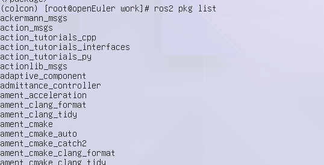

# 硬件信息

raspi 400

OS 版本：openEuler-22.03-LTS-SP2 rc6
root 密码： openeuler

镜像地址： http://121.36.84.172/dailybuild/EBS-openEuler-22.03-LTS-SP2/rc6_openeuler-2023-06-29-20-25-36/raspi_img/openEuler-22.03-LTS-SP2-raspi-aarch64.img.xz

- [软件源](./openEuler.repo) 
- [ROS 软件源](./openEulerROS.repo)
- [软件包列表](./packages.list)


# 安装与卸载
修改 /etc/yum.repo.d/ 中的 openEuler.repo

``` bash
dnf install openeuler-ros
```


再修改 openEulerROS.repo 为 [ROS 软件源](./openEulerROS.repo) 中的内容.

``` bash
dnf install -y `cat packages.list`
```


``` bash
dnf remove -y `cat packages.list`
```


成功

# colcon
尚未打包, 使用 pip

```
python3 -m venv colcon
source colcon/bin/activate
pip install colcon-common-extensions
mkdir -p work && cd work && colcon build && ls

```


输入命令之后，终端存在打印，且程序正常输出 log，测试通过

# 测试 ros 基础工具相关功能
测试前 `source /opt/ros/humble/setup.bash`

## ros2pkg
```
ros2 pkg prefix rpyutils
```


输入命令之后，终端存在打印，且程序正常输出 log，测试通过

### executable
```
ros2 pkg executable demo_nodes_cpp
```


输入命令之后，终端存在打印，且程序正常输出 log，测试通过

### xml
```
ros2 pkg xml demo_nodes_cpp
```


输入命令之后，终端存在打印，且程序正常输出 log，测试通过

### list



输入命令之后，终端存在打印，且程序正常输出 log，测试通过

## ros2topic
```
ros2 topic list
```


输入命令之后，终端存在打印，且程序正常输出 log，测试通过


## ros2param

分别执行 `ros2 run demo_nodes_cpp talker`, `ros2 param list` 


输入命令之后，终端存在打印，且程序正常输出 log，测试通过

## ros2service 
分别执行命令 `ros2 run demo_nodes_cpp talker`, `ros2 service list`


输入命令之后，终端存在打印，且程序正常输出 log，测试通过

## ros2node

分别执行命令 `ros2 run demo_nodes_cpp talker`, `ros2 node list`


输入命令之后，终端存在打印，且程序正常输出 log，测试通过

## ros2bag

### record


输入命令之后，终端存在打印，且程序正常输出 log, 测试通过
### info


输入命令之后，终端存在打印，且程序正常输出 log, 测试通过

### play


输入命令之后，终端存在打印，且程序正常输出 log, 测试通过

## ros2launch 


输入命令之后，终端存在打印，且程序正常输出 log，测试通过

### server 通信

#### python

在一个终端中输入
```
ros2 run demo_nodes_py add_two_ints_server
```

在另外一个终端中输入
```
ros2 run demo_nodes_py add_two_ints_client 
```


输入命令之后，终端存在打印，且程序正常输出 log，测试通过

#### cpp

在一个终端中输入
```
ros2 run demo_nodes_cpp add_two_ints_server
```

在另外一个终端中输入

```
ros2 run demo_nodes_cpp add_two_ints_client 
```


输入命令之后，终端存在打印，且程序正常输出 log，测试通过


## tf2

## 坐标转换的发布和订阅

### tf_monitor 监控

在一个终端中输入

```
ros2 run tf2_ros static_transform_publisher 1 1 1 0 0 0 /base_link /odom
```

在另一个终端中输入

```
ros2 run tf2_ros tf2_monitor
```


输入命令之后，终端存在打印，且程序正常输出 log，测试通过

### view_frames 保存 pdf

在一个终端中输入
`ros2 run tf2_ros static_transform_publisher 1 1 1 0 0 0 /base_link /odom`

在另一个终端中输入
`ros2 run tf2_tools view_frames`


检查当前目录，存在 pdf 文件，测试通过

